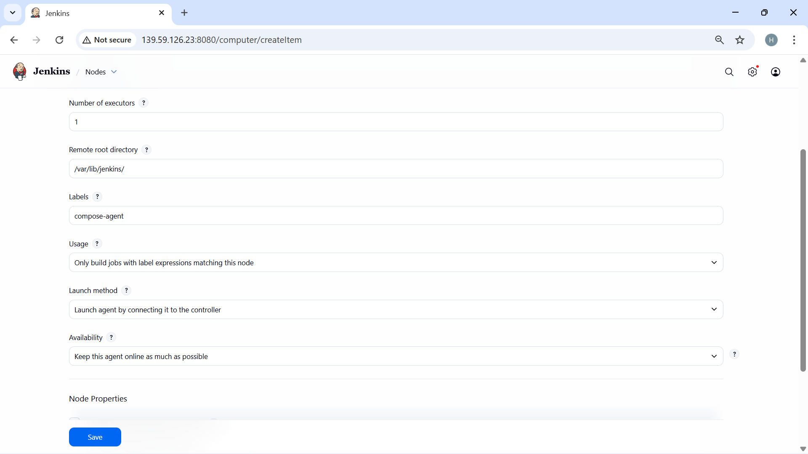
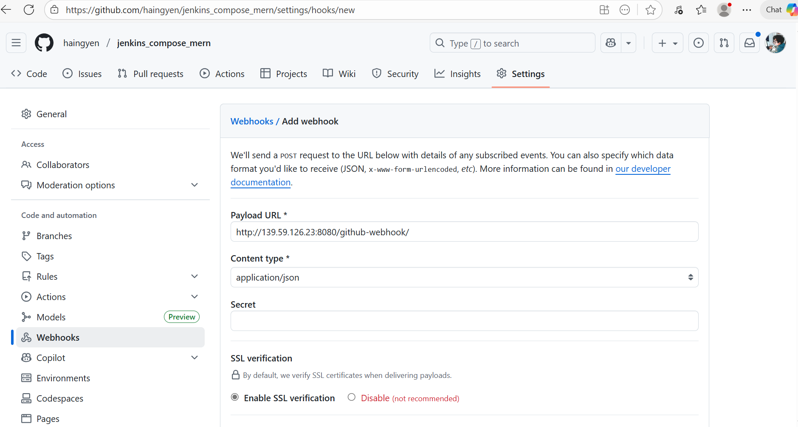

# Triển khai MERN Stack với Jenkins và Compose

Based on [TodoX](https://github.com/mtikcode/mtikcode_todoX.git) by [mtikcode].

Một ứng dụng full-stack được xây dựng với MERN stack (MongoDB, Express.js, React, Node.js), được tự động triển khai với Jenkins và container hóa với Docker Compose.

## 1. CI
### 1.1. Đóng gói ứng dụng với Docker
### 1.2. Tạo Jenkinsfile
### 1.3. Triển khai với Docker-compose `docker-compose.yaml`
## 2. CD
### 2.1. Tạo Jenkins server trên Digital Ocean

### 2.2. SSH vào Jenkins server

### 2.3. Cài đặt Jenkins
- Cài Java trước
```
sudo apt update
sudo apt install fontconfig openjdk-21-jre
java -version
```
- Cài Jenkins
```
sudo wget -O /etc/apt/keyrings/jenkins-keyring.asc \
  https://pkg.jenkins.io/debian-stable/jenkins.io-2023.key
echo "deb [signed-by=/etc/apt/keyrings/jenkins-keyring.asc]" \
  https://pkg.jenkins.io/debian-stable binary/ | sudo tee \
  /etc/apt/sources.list.d/jenkins.list > /dev/null
sudo apt update
sudo apt install jenkins
```

- Truy cập Jenkins UI
`<ipv4_jenkins_server>:8080`

- Lấy mật khẩu ban đầu để đăng nhập
`cat /var/lib/jenkins/secrets/initialAdminPassword`
- Cài Plugins được khuyến cáo

- Đăng nhập và cài thêm một số Plugins khác

- Cấu hình Agent với tên và label là `compose-agent`


- Tạo một server `compose-agent`, SSH vào và cài Java, Docker, Docker-compose

- Trên Jenkins agent tạo user `jenkins` và thêm groups `sudo`, `docker`. Tạo thêm thư mục `/var/lib/jenkins` và chuyển quyền sở hữu cho user `jenkins` và groups `jenkins`.
- Kết nối Jenkins-Controller đến agent bằng cách copy các file sau vào `/var/lib/jenkins` trên agent
```
echo 9b5a59e14cde7616d7ce98d5b0b4f6818c5ad8b5f2da8a2fc6d1f7e070662a18 > secret-file
curl -sO http://139.59.126.23:8080/jnlpJars/agent.jar
java -jar agent.jar -url http://139.59.126.23:8080/ -secret @secret-file -name "compose-agent" -webSocket -workDir "/var/lib/jenkins/"
```


- Tạo pipeline và kết nối đến Github


### 2.4. Cấu hình Webhook Github
Tự động kích hoạt Jenkins pipeline khi code có sự thay đổi (Push event)


